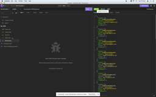
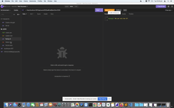
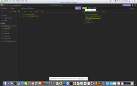
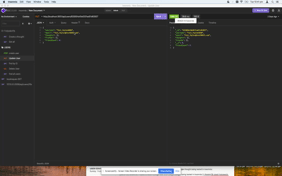
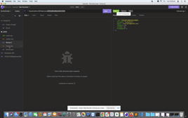

# Social-Network-API

 API for a social network web application where users can share their thoughts, react to friends’ thoughts, and create a friend list.

## Acceptance Criteria

```md
GIVEN a social network API
WHEN you enter the command to invoke the application
THEN your server is started and the Mongoose models are synced to the MongoDB database
WHEN you open API GET routes in Insomnia for users and thoughts
THEN the data for each of these routes will be displayed in a formatted JSON
WHEN you test API POST, PUT, and DELETE routes in Insomnia
THEN you will be able to successfully create, update, and delete users and thoughts in the database
WHEN you test API POST and DELETE routes in Insomnia
THEN you will be able to successfully create and delete reactions to thoughts and add and remove friends to a user’s friend list
```

## Mock Up

The following animations show examples of the application's API routes being tested in Insomnia.

The following animation shows GET routes to return all users and all thoughts being tested in Insomnia:




The following animation shows GET routes to return a single user and a single thought being tested in Insomnia:



The following animation shows the POST, PUT, and DELETE routes for users being tested in Insomnia:







In addition to this, your walkthrough video should show the POST, PUT, and DELETE routes for thoughts being tested in Insomnia.

The following animation shows the POST and DELETE routes for a user’s friend list being tested in Insomnia:


In addition to this, your walkthrough video should show the POST and DELETE routes for reactions to thoughts being tested in Insomnia.


---
© 2022 Nancy S. All Rights Reserved.
